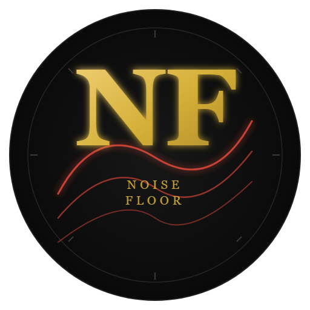

# NoiseFloor — Geopolitical Intelligence Dashboard



**BSc Computing final-year Big Data capstone** — Islington College / London Metropolitan University
Big Data with PySpark elective, Summer Industry Enrichment Program.

A PySpark + GDELT pipeline analysing how India's and China's media covered Nepal across three
national crises — the **2015 earthquake**, the **2015 border blockade**, and the **2025 Gen-Z
protests** — exported to CSVs and visualised in a scrollytelling web dashboard.

## Repository layout

```
NoiseFloor/
├── noiseui/                    # React 18 + Vite + Three.js frontend (NoiseUI)
│   ├── src/                    # source code (17 pages, components, utils, data)
│   ├── package.json            # dependencies (React, Three.js, Recharts, Framer Motion)
│   ├── vite.config.js          # Vite build config
│   └── tailwind.config.js      # Tailwind theme (gold/black console aesthetic)
├── backend/                    # Python pipeline + DSA + tests
├── data/                       # Event log + all pipeline CSVs
├── assets/                     # Brand mark + globe (vector + raster)
├── NoiseFloor.ipynb            # Original PySpark notebook
├── notebook_addendum.ipynb     # Nepal->India/China reverse analysis
└── README.md
```

## Visual identity

| | |
|---|---|
|  | **Brand mark (NF monogram)** — the gold-on-noir logo used in the README header, the React `<HeroSection>`, and anywhere the project is named. Vector source at `assets/logo-nf.svg`; 512×512 raster fallback at `assets/logo-nf.png`. |
|  | **Global coverage globe** — every article plotted as a dot on a Three.js sphere, sized by mention volume. The real-time GDELT feed pulses new events live on this surface. Vector source at `assets/earth-gold-globe.svg`; raster fallback at `assets/earth-gold-globe.png`. |

**Palette:** dark (`#0a0a0a`) + gold (`#d4af37`) + alert red (`#e74c3c`) — no bright marketing colours, because the product is a data console, not a landing page.

**All 4 files in `assets/`** (1 brand mark + 1 globe, each as vector + raster):

```
assets/
├── logo-nf.svg          2.8 KB   ← NF monogram (vector)
├── logo-nf.png          102 KB   ← NF monogram (raster, 512×512)
├── earth-gold-globe.svg  87 KB   ← globe continents (vector)
└── earth-gold-globe.png 233 KB   ← globe continents (raster)
```

## Running everything

### One-time setup (if not already done)
```bash
python -m venv .venv
.venv\Scripts\python -m pip install -r backend\requirements.txt
cd noiseui && npm install
```

### Run tests (DSA index correctness + benchmark + locked-findings sanity)
```bash
.venv\Scripts\python -m pytest backend\tests -v
```

### Regenerate the frontend data bundle after any CSV change
```bash
.venv\Scripts\python backend\build_data.py
```

### (Optional) fetch the Regional Lens datasets — resumable, cached, 429-safe
```bash
.venv\Scripts\python backend\build_extended.py
.venv\Scripts\python backend\build_data.py   # merge extended data into the bundle
```

> **Note:** the Cross-Reactions and Nepal Dividend pages already work using an offline-derived
> baseline (see `noiseui/src/data/regionalLens.js` — `source` field on each object). They populate
> immediately on load; the optional GDELT fetch above only enriches them with live 30-day data.

### Open the NoiseUI dashboard (development mode)
```bash
cd noiseui && npm run dev
```

### OR serve the production build
```bash
# (after npm run build, serve noiseui/dist/ with any static server)
python -m http.server 8765 --directory noiseui/dist
```

## GDELT quirk worth knowing
The DOC 2.0 API validates `sourcecountry:` against **FIPS 10-4 codes**, so China is `CH`, not `CN`. An invalid code returns an empty JSON object `{}`, which looks like "no coverage" and can silently poison the dataset cache with nulls for every China cell. Both `build_extended.py` and the Live Feed's CN·EN stream use `sourcecountry:CH`.

The Live Feed calls the GDELT DOC API directly from the browser. If a host ever blocks the request, an explicit error state is shown and the dashboard keeps working.

## Colab work
Upload `notebook_addendum.ipynb` to Colab and run top-to-bottom after the main notebook has produced the `nepal_events` parquet.

## Git workflow

```bat
git remote add origin https://github.com/yogeshpan1/NoiseFloor.git
git push -u origin main        :: authenticate in the browser popup if prompted
```

Commits are split per concern (baseline -> backend/DSA -> frontend features -> docs) so each professor
feedback item can be pointed at its own diff.
